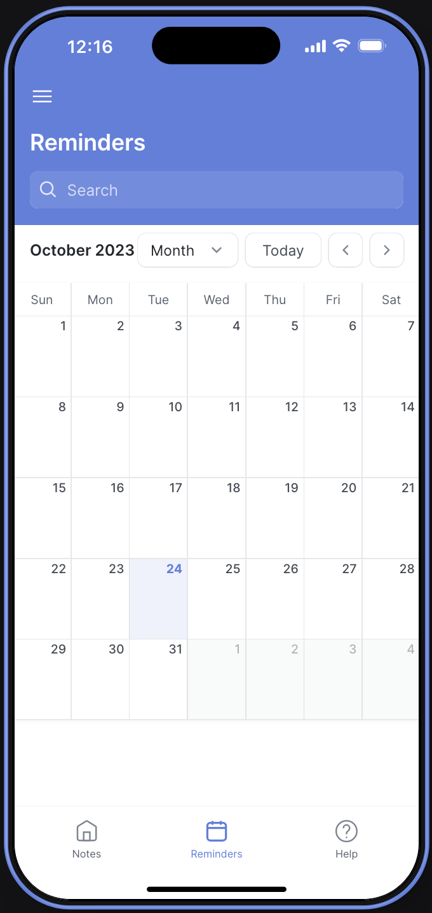

<!--
!!! IMPORTANT !!!
This README is an example of how you could professionally present your codebase. 
Writing documentation is a crucial part of your work as a professional software developer and cannot be ignored. 

You should modify this file to match your project and remove sections that don't apply.

REQUIRED SECTIONS:
- Table of Contents
- About the Project
  - Built With
  - Live Demo
- Getting Started
- Authors
- Future Features
- Contributing
- Show your support
- Acknowledgements
- License

OPTIONAL SECTIONS:
- FAQ

After you're finished please remove all the comments and instructions!

For more information on the importance of a professional README for your repositories: https://github.com/microverseinc/curriculum-transversal-skills/blob/main/documentation/articles/readme_best_practices.md
-->

  <!-- You are encouraged to replace this logo with your own! Otherwise you can also remove it. -->
  
   

  

<!-- TABLE OF CONTENTS -->

# 📗 Table of Contents

- [📖 About the Project](#about-project)
  - [🛠 Built With](#built-with)
    - [Tech Stack](#tech-stack)
    - [Key Features](#key-features)
  - [🚀 Live Demo](#live-demo)
- [👥 Authors](#authors)
- [🔭 Future Features](#future-features)
- [🤝 Contributing](#contributing)
- [⭐️ Show your support](#support)
- [📝 License](#license)

<!-- PROJECT DESCRIPTION -->

# 📖 Revise AI 

-     "Revise AI" is an innovative educational tool that leverages cutting-edge AI technology to
      facilitate seamless lecture transcription and intelligent content revision. It empowers
      students and educators to effortlessly review and enhance educational materials, fostering
      a collaborative and efficient learning experience.

## 🛠 Built With 

### Tech Stack 

> Describe the tech stack and include only the relevant sections that apply to your project.

  
Client

  <ul>
    <li><a href="https://www.glideapps.com/">Glide Apps</a></li>
  </ul>

  
API

  <ul>
    <li><a href="https://openai.com/blog/openai-api">Open AI</a></li>
    <li><a href="https://www.glideapps.com/ai">Glide AI</a></li>
  </ul>

Database

  <ul>
    <li><a href="https://www.google.ca/sheets/about/">Google Sheets</a></li>
  </ul>

<!-- Features -->

### Key Features 

> Describe between 1-3 key features of the application.

-         AI-Powered Transcription: Utilize advanced AI technology to transcribe lectures and audio content
          accurately in real-time or from pre-recorded files.
-         Intelligent Revision Assistance: Receive comprehensive and insightful content revisions generated
          by the AI, helping users grasp key concepts and improve study materials.
-         Lecture Organization and Management: Organize and manage lectures efficiently with the ability to
          categorize, search, and filter content for easy access.

(<a href="#readme-top">back to top</a>)

<!-- LIVE DEMO -->

## 🚀 Live Demo 

> Add a link to your deployed project.

- [Live Demo Link](https://google.com)
  
  
  
  
  
  
  
  

(<a href="#readme-top">back to top</a>)

<!-- GETTING STARTED -->

<!-- AUTHORS -->

## 👥 Authors 

> Mention all of the collaborators of this project.

👤 **Author1**

- GitHub: (https://github.com/BD0712)
- LinkedIn: (https://www.linkedin.com/in/bitaniyadefar/)

(<a href="#readme-top">back to top</a>)

<!-- FUTURE FEATURES -->

## 🔭 Future Features 

> Features that will be added to the project in the future.

- [ ] Adaptive Learning Algorithms: Incorporate adaptive learning algorithms that personalize the learning journey
      based on individual progress, providing tailored recommendations and study materials.
- [ ] Voice Command Functionality: Implement voice command functionality for hands-free navigation and interaction,
      enabling users to access and control app features using voice prompts and commands.
- [ ] Language Support Expansion: Expand language support to accommodate a diverse user base, offering multilingual
      transcription and revision capabilities for a broader global reach.

(<a href="#readme-top">back to top</a>)

<!-- CONTRIBUTING -->

## 🤠Contributing 

Contributions, issues, and feature requests are welcome!

Feel free to check the [issues page](../../issues/).

(<a href="#readme-top">back to top</a>)

<!-- SUPPORT -->

## ⭐️ Show your support 

> Write a message to encourage readers to support your project

If you like this project please feel free to reach out to the author.

(<a href="#readme-top">back to top</a>)

<!-- LICENSE -->

## 📠License 

This project is [MIT](./LICENSE) licensed.

(<a href="#readme-top">back to top</a>)

